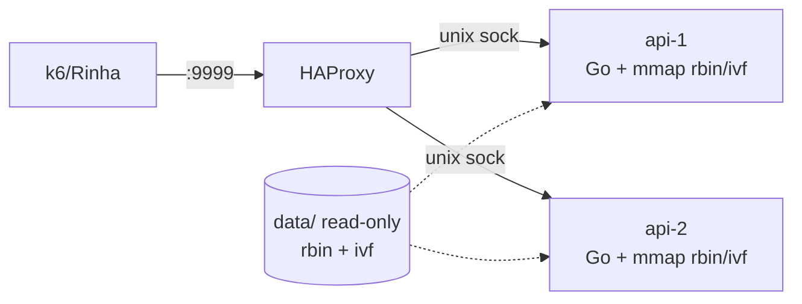

# Heimdall

Backend de **detecção de fraude por busca vetorial** para a [Rinha de Backend 2026](https://github.com/zanfranceschi/rinha-de-backend-2026).

---

## O que o serviço faz

- Expõe **`GET /ready`** (2xx quando o índice está carregado) e **`POST /fraud-score`** (payload da transação → decisão).
- Para cada transação: **vetor de 14 dimensões** (normalização do doc oficial, sentinela `-1` quando `last_transaction` é `null`) → **5 vizinhos mais próximos** no dataset de referência (distância euclidiana) → **`fraud_score` = fração de fraudes entre esses 5** → **`approved = fraud_score < 0.6`**.

Especificação de campos e fórmulas: [docs/br no repo da Rinha](https://github.com/zanfranceschi/rinha-de-backend-2026/tree/main/docs/br).

---

## Estratégia atual

| Camada | Decisão | Por quê |
|--------|---------|---------|
| **Dataset** | `.rbin` (binário compacto, 64 B/linha: 14×float32 + label + partição) **+ mmap read-only** | Zero parsing em runtime; pages compartilhadas entre as 2 réplicas; sem heap nos 3 M vetores |
| **Busca vetorial** | **IVF (ANN) com re-ranking exato** sobre os candidatos | KNN exato a 900 req/s × 0,9 CPU → impossível. IVF reduz **3 M → ~10 k** candidatos com precisão controlada |
| **Tamanho do índice** | **2048 listas** (default; configurável) | Clusters de ~1465 vetores → fronteiras finas → `nprobe` pequeno já cobre o top-5 real |
| **Probes + cap** | `KNN_NPROBE=16`, `KNN_IVF_MAX_CANDIDATES=10000` | Cobre região do query sem estourar memory bandwidth no container de 0,45 CPU |
| **Centroid ranking** | **Top-K via min-heap** em float32 (sem `sort.Slice`/reflection) | 2048 distâncias + heap-of-16 → ~80 µs vs ~300 µs do full sort |
| **Distância** | Loop unrolled 14 dims (float32 para centroides, float64 para rbin row) | SSE-friendly; o compilador Go gera FMAs limpas |
| **Top-5 do scan** | Array `[5]rbinCand` em **stack**, linear scan do worst | Sem heap-alloc; k pequeno favorece linear |
| **HTTP** | `net/http` puro, sem framework | Hot path direto; mux só duas rotas |
| **JSON** | `io.Read` em buffer pooled (2 KB) + `json.Unmarshal`; resposta **escrita à mão** com `strconv.AppendFloat` | Evita `json.Decoder` (4 KB alloc) e `Encoder` interno |
| **Pools** | `sync.Pool` para request struct, body buffer, response buffer, IVF centroids, IVF probe list | Hot path zero-alloc após warmup |
| **Concorrência** | `GOMAXPROCS=1` por réplica | Com 0,45 CPU por container, 1 P evita disputa do scheduler |
| **GC** | `GOGC=200` + soft `MemoryLimit=120 MB` | GC só dispara quando heap dobra ou perto do teto → pausas raras e curtas |
| **Warmup** | Pré-toca **só o `.ivf`** no startup (centroides + offsets + postings) | Sem page faults no IVF; `.rbin` é tocado por queries (lazy) sem forçar RSS além do limite do container |
| **LB** | **HAProxy** (`nbthread=2`, `http-reuse always`, timeouts apertados) | Round-robin entre 2 APIs via **Unix sockets** em `tmpfs` |

---

## Arquitetura de deploy



| Serviço | CPU | Memória | Papel |
|---------|-----|---------|-------|
| `lb` (HAProxy) | 0,10 | 32 MB | LB porta 9999, round-robin |
| `api-1` | 0,45 | 159 MB | API Go + mmap |
| `api-2` | 0,45 | 159 MB | API Go + mmap |
| **Total** | **1,00 CPU** | **350 MB** | Dentro do limite da Rinha |

---

## Trade-off latência × precisão

A pontuação é `score_p99 + score_det` (cada um −3000 a +3000). Cada **10×** vale **+1000**.

| Parâmetro | Sobe latência (p99 ↑) | Reduz erros (det ↑) |
|-----------|----------------------|---------------------|
| `KNN_NPROBE` ↑ | sim | sim |
| `KNN_IVF_MAX_CANDIDATES` ↑ | sim (linear) | sim |
| Mais listas no `.ivf` (`-lists 2048→4096`) | leve (centroides + grandes) | sim (clusters mais finos) |
| Menos listas | leve (centroides −) | não (perde precisão) |

Heurística: o `p99_score` satura em 1 ms (+3000). Acima de 4–5 ms, **vale mais aumentar precisão** (NPROBE/maxCand) do que cortar latência.

---

## Estrutura do repositório

| Caminho | Função |
|---------|--------|
| `cmd/api` | Servidor HTTP (hot path) |
| `cmd/genrefs` | `references.json.gz` → `references.rbin` |
| `cmd/genivf` | Treina k-means paralelo → `references.ivf` |
| `internal/vector` | Vetorização (14 dims, normalização, partição) |
| `internal/knn` | Busca exata e **IVF + re-rank** sobre mmap |
| `internal/reference` | Loader JSON, formatos `.rbin` e `.ivf`, mmap |
| `internal/app` | `Service` + `ReferenceIndex` híbrido (exact/IVF) + warmup |
| `internal/httpserver` | Handler `/fraud-score` zero-alloc |
| `deploy/haproxy.cfg` | LB porta 9999 (nbthread, http-reuse) |
| `deploy/nginx.conf` | Variante Nginx (upstream keepalive) |
| `data/` | `normalization.json`, `mcc_risk.json`; `references.{json.gz,rbin,ivf}` gerados localmente |
| `docs/` | Tutorial de submissão + ambiente de testes |
| `scripts/` | `smoke.ps1`, `test.ps1`, `test.sh` |

---

## Arranque rápido

### 1. Gerar `.rbin` e `.ivf` (uma vez)

Baixe `references.json.gz` do [repo da Rinha](https://github.com/zanfranceschi/rinha-de-backend-2026/tree/main/resources) para `data/`.

```powershell
go run ./cmd/genrefs -in .\data\references.json.gz -out .\data\references.rbin
go run ./cmd/genivf  -rbin .\data\references.rbin -out .\data\references.ivf -lists 2048 -iter 15 -workers 8
```

Ou via Makefile (Linux/macOS/WSL):

```bash
make gendata       # rbin + ivf com 512 listas (rápido)
make genivf-hq     # ivf com 2048 listas (melhor precisão, mais demorado)
```

### 2. Subir o stack

```powershell
docker compose up -d --build
curl.exe -fsS http://localhost:9999/ready
.\scripts\smoke.ps1
```

### 3. Testes Go locais

```powershell
.\scripts\test.ps1
```

### 4. Teste de carga oficial

Tutorial completo: [`docs/submissao-e-teste-de-carga.md`](docs/submissao-e-teste-de-carga.md).

```powershell
cd ..\rinha-de-backend-2026
$env:K6_NO_USAGE_REPORT = "true"
k6 run test/test.js
Get-Content .\test\results.json
```

---

## Variáveis de ambiente (API)

| Variável | Default | Significado |
|----------|---------|-------------|
| `LISTEN` | `:8080` | `:porta` (TCP) ou `unix:/caminho/socket.sock` |
| `DATA_DIR` | `./data` | Pasta de `normalization.json` e `mcc_risk.json` |
| `REFERENCE_PATH` | `$DATA_DIR/references.rbin` | Caminho do `.rbin` (ou `.json[.gz]` para modo memória) |
| `REFERENCE_IVF_PATH` | `<rbin>.ivf` | Caminho do `.ivf` (auto-derivado se vazio) |
| `KNN_MODE` | `auto` | `auto` (IVF se existir), `ivf` (exige), `exact` |
| `KNN_NPROBE` | `16` | Listas a varrer no IVF |
| `KNN_IVF_MAX_CANDIDATES` | `10000` | Teto de candidatos re-rankeados por query |
| `KNN_WORKERS` | `0` | Goroutines no scan exato (0 = auto, mas ignorado no modo IVF) |
| `MIN_REFERENCES` | `2000000` | Falha startup se `idx.Len()` < N (evita dataset minúsculo) |
| `WARMUP` | `1` | Toca páginas do `.ivf` no boot |
| `METRICS` | `0` | Liga `/metrics` Prometheus (custo no hot path) |
| `GOMAXPROCS` | `1` | Recomendado 1 em containers de 0,45 CPU |
| `GOGC` | `200` | GC dispara quando heap = 3× live; menos pausas |
| `HEIMDALL_MEM_LIMIT_BYTES` | — | Soft memory limit (precisa GC ativa) |
| `ALLOW_SMALL_REFERENCES` | `0` | Em dev, permite o `.rbin` embutido (5 vetores) |

---

## Status / progressão de pontuação

Histórico real em testes locais com o `test.js` oficial:

| Estado | p99 | det_score | final_score |
|--------|-----|-----------|-------------|
| KNN exato em 3 M (sem IVF) | 2001 ms (timeout) | -3000 | **-6000** |
| IVF 512 listas, maxCand=120 k | 2001 ms | -3000 | **-6000** |
| IVF 512, maxCand=15 k | 463 ms | 1301 | **2046** |
| IVF 512, maxCand=8 k + JSON otimizado | 4 ms | 1301 | **3694** |
| IVF 2048, maxCand=14 k + warmup grande | 693 ms (page faults) | 2609 | **2768** |
| Imagem antiga/cache (binário inconsistente) | 157 ms | -3000 | **-2198** |
| **IVF 2048, maxCand=10 k, nprobe 16, digest pinado** | 460 ms | 2603 | **2940** |
| **+ madvise + pre-touch rbin + GOMAXPROCS=2 + maxCand 4 k + nprobe 12** | alvo <100 ms | ~2400 | **alvo 5000+** |

### Por que p99 alto na Rinha vs p99 baixo local

Localmente o `.rbin` (192 MB) cabe inteiro no page cache e cada query toca ~10 k vetores
quase sem I/O. Na Rinha, o host divide o cache entre muitos containers concorrentes e o
acesso por IVF é **aleatório** em 192 MB → page faults dominam o p99.

Mitigações aplicadas:

- `madvise(MADV_RANDOM)` no `.rbin` desliga readahead inútil.
- `madvise(MADV_WILLNEED)` no `.ivf` (12 MB) mantém centróides + postings residentes.
- Warmup faz **pre-touch leve** (1 byte por página) do `.rbin` para reduzir o pico inicial.
- `KNN_IVF_MAX_CANDIDATES=4000` (em vez de 10 k) corta o número de páginas tocadas por
  query — a detecção já estava com 0,02 % de erro, sobra muita folga.
- `GOMAXPROCS=2` evita enfileiramento sob 900 req/s com `cpus: "0.45"` por API.
- HAProxy com `nbthread 1` (sob `cpus: "0.10"` 2 threads competem, não somam).

---

## Submissão à Rinha

Tutorial passo a passo (branches, PR, issue `rinha/test`, k6 oficial): [`docs/submissao-e-teste-de-carga.md`](docs/submissao-e-teste-de-carga.md).

Resumo:

1. `info.json` na raiz e na branch `submission`.
2. Branch `submission` com **apenas** `docker-compose.yml`, `Dockerfile`, `deploy/`, `info.json` (sem código-fonte).
3. PR em `participants/SEU_USUARIO.json` no repo da Rinha.
4. Issue com descrição `rinha/test` para prévia oficial.

---

## Licença

Veja o ficheiro `LICENSE` (MIT) — requisito da Rinha.
