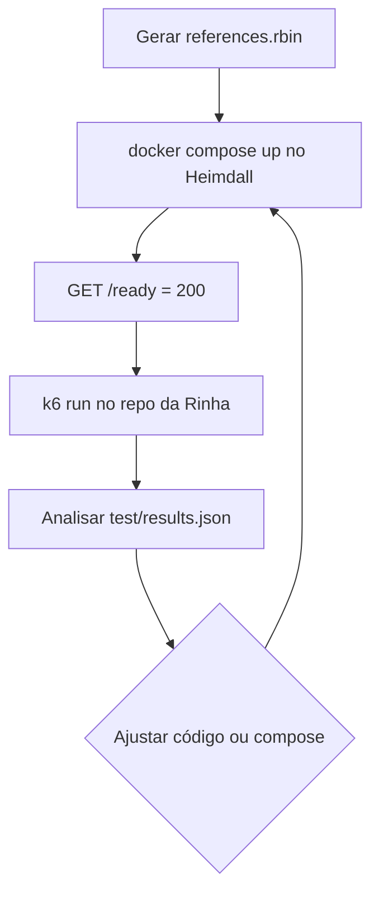

# Submissão e teste de carga (Rinha 2026)

Tutorial passo a passo para preparar o **Heimdall**, submeter à [Rinha de Backend 2026](https://github.com/zanfranceschi/rinha-de-backend-2026) e rodar o **mesmo teste de carga k6** usado nas prévias oficiais.

Documentação oficial de referência:

- [Desafio](https://github.com/zanfranceschi/rinha-de-backend-2026/blob/main/docs/br/README.md)
- [Submissão](https://github.com/zanfranceschi/rinha-de-backend-2026/blob/main/docs/br/SUBMISSAO.md)
- [Avaliação e pontuação](https://github.com/zanfranceschi/rinha-de-backend-2026/blob/main/docs/br/AVALIACAO.md)
- [Arquitetura](https://github.com/zanfranceschi/rinha-de-backend-2026/blob/main/docs/br/ARQUITETURA.md)

---

## Checklist antes de submeter

| Item | Detalhe |
|------|---------|
| Licença **MIT** | Obrigatória em todos os repositórios da participação |
| Repositório **público** | O link do `participants/*.json` deve apontar para um repo acessível |
| API na porta **9999** | O load balancer expõe `GET /ready` e `POST /fraud-score` |
| **LB + 2 APIs** | Round-robin, sem lógica de negócio no LB |
| Limites Docker | Soma **≤ 1 CPU** e **≤ 350 MB** entre todos os serviços |
| Imagens **`linux/amd64`** | `platform: linux/amd64` no `docker-compose.yml` |
| Rede **`bridge`** | Sem `network_mode: host` nem `privileged` |
| Dataset completo | `references.rbin` com ~3M vetores (não usar só o exemplo de 5 linhas) |
| Branches **`main`** e **`submission`** | Código em `main`; só artefatos de execução em `submission` |
| `info.json` | Metadados da equipe/stack (raiz do repo e na branch `submission`) |

Prazo de submissão (edição 2026): até **2026-06-05T23:59:59.999-03:00** (ver [SUBMISSAO.md](https://github.com/zanfranceschi/rinha-de-backend-2026/blob/main/docs/br/SUBMISSAO.md)).

---

## 1. Preparar dados e binário de referência

### 1.1 Baixar arquivos oficiais

No repositório da Rinha, pasta [`resources/`](https://github.com/zanfranceschi/rinha-de-backend-2026/tree/main/resources):

- `references.json.gz` (~3M vetores)
- `normalization.json`
- `mcc_risk.json`

Coloque em `data/` neste projeto:

```text
heimdall/data/
  references.json.gz    # download manual (gitignore)
  normalization.json    # pode versionar (cópia do repo da Rinha)
  mcc_risk.json
  references.rbin         # gerado localmente (gitignore)
```

### 1.2 Gerar `references.rbin` e `references.ivf`

O Heimdall usa mmap sobre um binário compacto. O **teste k6 a ~900 req/s** exige o índice **IVF** (busca aproximada + re-ranking); o scan exato em 3M vetores estoura o timeout de **2001 ms** e gera `http_errors: 100%` / `final_score: -6000`.

**PowerShell (Windows):**

```powershell
go run ./cmd/genrefs -in .\data\references.json.gz -out .\data\references.rbin
go run ./cmd/genivf -rbin .\data\references.rbin -out .\data\references.ivf -lists 512 -iter 12
```

**Bash (Linux/macOS/WSL):**

```bash
make gendata
```

Ou manualmente:

```bash
go run ./cmd/genrefs -in ./data/references.json.gz -out ./data/references.rbin
go run ./cmd/genivf -rbin ./data/references.rbin -out ./data/references.ivf -lists 512 -iter 12
```

A conversão do `.rbin` demora alguns minutos. O `.ivf` roda **k-means em 3M pontos** — com **512 listas** costuma levar **5–15 min** (mostra progresso por iteração); com **2048 listas** pode passar de **1 hora**. O código `0xc000013a` no Windows costuma ser **Ctrl+C** ao cancelar. Sem estes ficheiros, o `docker-compose` falha no arranque (`MIN_REFERENCES=2000000` e `KNN_MODE=ivf`).

### 1.3 Desenvolvimento rápido (opcional)

Para smoke local **sem** os 3M vetores, use variáveis de desenvolvimento (não use na submissão):

```yaml
environment:
  MIN_REFERENCES: "0"
  ALLOW_SMALL_REFERENCES: "1"
```

---

## 2. Subir o backend localmente

Na raiz do Heimdall:

```powershell
docker compose up -d --build
```

Verificar:

```powershell
Invoke-WebRequest http://localhost:9999/ready -UseBasicParsing
.\scripts\smoke.ps1
```

Ou com curl (Git Bash / WSL / Linux):

```bash
curl -fsS http://localhost:9999/ready
./scripts/smoke.ps1   # se tiver PowerShell; ou POST manual conforme scripts/smoke.ps1
```

O compose atual expõe:

- **HAProxy** em `localhost:9999`
- **2 réplicas** da API Go via Unix sockets
- Volume `./data:/data:ro` com `references.rbin`

Parar:

```powershell
docker compose down
```

---

## 3. Estrutura de submissão (branches)

### Branch `main`

Todo o código-fonte, testes, `Dockerfile`, `deploy/`, `info.json`, etc.

### Branch `submission`

**Apenas** o necessário para a engine da Rinha executar o teste. Exemplo típico para o Heimdall:

```text
submission/
  docker-compose.yml      # na raiz da branch
  info.json
  deploy/
    haproxy.cfg
  Dockerfile              # se o compose fizer build: .
```

Regras importantes:

- O `docker-compose.yml` deve estar na **raiz** da branch `submission`.
- O código Go **não** deve estar nesta branch (só imagem publicada ou build mínimo, conforme sua estratégia).
- Muitos participantes publicam a imagem no GHCR/Docker Hub e referenciam `image:` no compose da submission.

### Criar/atualizar a branch `submission` (exemplo)

```bash
git checkout main
git pull

git checkout --orphan submission
git reset --hard

# Copiar só os ficheiros de deploy (ajuste à sua estratégia de imagem)
cp docker-compose.yml info.json Dockerfile ./
cp -r deploy ./

git add .
git commit -m "submission: artefatos para teste da Rinha"
git push -u origin submission
```

Volte ao desenvolvimento com `git checkout main`.

### `info.json`

Edite o ficheiro na raiz (modelo em `info.json`):

```json
{
  "participants": ["Seu Nome"],
  "social": ["https://github.com/SEU_USUARIO"],
  "source-code-repo": "https://github.com/SEU_USUARIO/heimdall",
  "stack": ["go", "haproxy", "mmap", "knn"],
  "open_to_work": false
}
```

Inclua o mesmo ficheiro na branch `submission`.

---

## 4. Inscrição no repositório da Rinha

1. Fork do [rinha-de-backend-2026](https://github.com/zanfranceschi/rinha-de-backend-2026).
2. Crie `participants/SEU_USUARIO_GITHUB.json`:

```json
[
  {
    "id": "heimdall-go",
    "repo": "https://github.com/SEU_USUARIO/heimdall"
  }
]
```

- O nome do ficheiro deve ser **exatamente** o seu usuário GitHub.
- `id` é o identificador da submissão (opcional na issue de teste).
- `repo` deve apontar para o repositório público com branches `main` e `submission`.

3. Abra um **Pull Request** com esse JSON.

---

## 5. Teste de prévia oficial (issue)

Depois do PR de participante aceito (ou em fork para testar o fluxo):

1. No repo **zanfranceschi/rinha-de-backend-2026**, abra uma **Issue**.
2. Na **descrição**, coloque exatamente:

```text
rinha/test
```

ou, para uma entrada específica do seu JSON:

```text
rinha/test heimdall-go
```

3. A engine clona a branch `submission`, sobe o `docker-compose`, espera `GET http://localhost:9999/ready`, executa o k6 e comenta o resultado (JSON de pontuação) na issue.

Limite: até **5 prévias por dia** por participante (`config.json` da Rinha).

---

## 6. Teste de carga real pelo repo da Rinha (local)

Este é o mesmo script que gera `test/results.json` e calcula `final_score` (p99 + detecção). O k6 envia tráfego para **`http://localhost:9999`** — o seu Heimdall deve estar a correr **antes** de executar o teste.

### 6.1 Pré-requisitos

| Ferramenta | Uso |
|------------|-----|
| [k6](https://grafana.com/docs/k6/latest/set-up/install-k6/) | Executor de carga |
| [jq](https://jqlang.org/download/) | Ler o JSON de resultados (`run.sh` oficial) |
| Docker | Heimdall no ar em `:9999` |

**Windows — instalação rápida (winget):**

```powershell
winget install k6
winget install jqlang.jq
```

No Windows, o `run.sh` oficial é mais simples em **Git Bash** ou **WSL**. Em PowerShell puro, use o comando k6 da secção 6.4.

### 6.2 Clonar o repositório da Rinha

```bash
git clone https://github.com/zanfranceschi/rinha-de-backend-2026.git
cd rinha-de-backend-2026
```

Não é necessário clonar dentro do Heimdall; pode ficar em qualquer pasta irmã, por exemplo:

```text
PROJETOS_CODE_2/
  heimdall/          # seu backend
  rinha-de-backend-2026/   # scripts de teste
```

### 6.3 Subir o Heimdall e confirmar readiness

No diretório **heimdall**:

```powershell
docker compose up -d --build
```

Aguarde as APIs carregarem o mmap (~3M vetores). Confirme:

```powershell
curl.exe -fsS http://localhost:9999/ready
```

Deve retornar HTTP 200. Se falhar, veja logs:

```powershell
docker compose logs -f api-1 api-2 lb
```

### 6.4 Executar o teste k6

O cenário oficial (`test/test.js`):

- **120 segundos** de rampa até **900 req/s** (`ramping-arrival-rate`)
- **5000** requisições rotuladas em `test/test-data.json`
- Timeout por request: **2001 ms**
- Endpoint fixo: `POST http://localhost:9999/fraud-score`

**Opção A — script oficial (Bash / Git Bash / WSL):**

```bash
cd rinha-de-backend-2026
export K6_NO_USAGE_REPORT=true
./run.sh
```

O `run.sh` executa `k6 run test/test.js` e imprime `test/results.json` formatado com `jq`.

**Opção B — k6 direto (PowerShell ou qualquer SO):**

```powershell
cd C:\caminho\para\rinha-de-backend-2026
$env:K6_NO_USAGE_REPORT = "true"
k6 run test/test.js
```

**Opção C — k6 com resumo no terminal (sem suprimir saída):**

```bash
cd rinha-de-backend-2026
export K6_NO_USAGE_REPORT=true
k6 run test/test.js
cat test/results.json | jq .
```

### 6.5 Ler o resultado

Ficheiro gerado: `rinha-de-backend-2026/test/results.json`.

Campos principais:

| Campo | Significado |
|-------|-------------|
| `p99` | Latência no percentil 99 |
| `scoring.breakdown` | TP, TN, FP, FN, `http_errors` |
| `scoring.failure_rate` | `(FP + FN + Err) / N` — corte rígido em **15%** |
| `scoring.p99_score.value` | Pontos de latência (−3000 a +3000) |
| `scoring.detection_score.value` | Pontos de detecção (−3000 a +3000) |
| `scoring.final_score` | **Soma** dos dois componentes |

Interpretação detalhada: [AVALIACAO.md](https://github.com/zanfranceschi/rinha-de-backend-2026/blob/main/docs/br/AVALIACAO.md).

**PowerShell — ver resultado sem jq:**

```powershell
Get-Content .\test\results.json | ConvertFrom-Json | ConvertTo-Json -Depth 10
```

### 6.6 Ordem recomendada de um ciclo completo



1. Gerar `data/references.rbin` se ainda não existir.
2. `docker compose up -d --build` no Heimdall.
3. `curl http://localhost:9999/ready`.
4. `k6 run test/test.js` no clone da Rinha (~2 min de teste + rampa).
5. Ajustar performance/precisão e repetir.

### 6.7 Tuning para `final_score` alto

A pontuação satura nos extremos: cada **10× de p99** vale **+1000** e cada **10× de erros** vale **+1000** (com penalidade absoluta). Heurística:

| Faixa atual | Próximo passo |
|-------------|--------------|
| `final_score` < 0 (cortes ativos) | Habilitar IVF e gerar `.ivf`; reduzir `KNN_IVF_MAX_CANDIDATES` |
| 2000–3500 (p99 baixo, detecção média) | Aumentar `KNN_NPROBE` e `KNN_IVF_MAX_CANDIDATES` aos poucos |
| 3500–4500 (p99 < 10 ms, FP+FN > 100) | **Regenerar IVF com mais listas** (`-lists 2048` ou `4096`) |
| > 4500 | Otimização fina: warmup, parsing manual de tempo, AVX/asm |

**Regeneração recomendada para `final_score > 4500`:**

```powershell
go run ./cmd/genivf -rbin .\data\references.rbin -out .\data\references.ivf -lists 2048 -iter 15 -workers 8
```

Com 2048 listas, cada cluster tem ~1465 vetores (vs ~5860 com 512), os top-N vizinhos caem em menos listas → menos candidatos para a mesma precisão. Esperar: training ~15–40 min, `KNN_NPROBE=16`, `KNN_IVF_MAX_CANDIDATES=14000`.

### 6.8 Problemas comuns no teste local

| Sintoma | Causa provável | O que fazer |
|---------|----------------|-------------|
| `http_errors` ≈ total, `p99` ≈ **2001 ms**, `final_score: -6000` | KNN **exato** em 3M vetores por request (não aguenta 900 req/s) | Gerar `references.ivf`, `KNN_MODE=ivf` no compose, rebuild (`make gendata` + `docker compose up --build`) |
| Muitos `http_errors` | Timeout 2001 ms, APIs ainda a carregar, ou CPU saturada | Ver logs; garantir `ready` antes do k6; rever limites de CPU no compose |
| Muitos FP/FN com IVF | `KNN_NPROBE` baixo demais | Subir `KNN_NPROBE` (ex.: 64) ou `-lists` no `genivf` (ex.: 4096); medir de novo |
| `failure_rate` > 15% | Muitos FP/FN/HTTP | Corrigir lógica KNN; não subir sem `references.rbin` completo |
| `connection refused` :9999 | Compose parado ou porta ocupada | `docker compose ps`; libertar porta 9999 |
| Pontuação “boa” em dev, má na prévia | Máquina local mais forte que Mac Mini da Rinha | Testar com limites do compose (1 CPU / 350 MB) |
| k6 não encontra `test-data.json` | Diretório errado | Executar sempre a partir da raiz do clone da Rinha |

---

## 7. Testes rápidos deste repositório (sem k6)

Para validação contínua no desenvolvimento:

```powershell
.\scripts\test.ps1          # go vet + go test
.\scripts\smoke.ps1         # 1 request após docker up
```

Ver também [ambiente-de-testes.md](./ambiente-de-testes.md).

---

## 8. Resumo dos comandos

```powershell
# --- Heimdall: preparar e subir ---
go run ./cmd/genrefs -in .\data\references.json.gz -out .\data\references.rbin
go run ./cmd/genivf -rbin .\data\references.rbin -out .\data\references.ivf -lists 512 -iter 12
docker compose up -d --build
curl.exe -fsS http://localhost:9999/ready
.\scripts\smoke.ps1

# --- Rinha: carga real (outro terminal, após clone do repo oficial) ---
cd ..\rinha-de-backend-2026
$env:K6_NO_USAGE_REPORT = "true"
k6 run test/test.js
Get-Content .\test\results.json

# --- Submissão ---
# 1. Branch submission + info.json + docker-compose na raiz
# 2. PR em participants/SEU_USUARIO.json no repo da Rinha
# 3. Issue com descrição: rinha/test heimdall-go
```

---

## Links úteis

- Repositório do desafio: https://github.com/zanfranceschi/rinha-de-backend-2026
- Script de teste: https://github.com/zanfranceschi/rinha-de-backend-2026/blob/main/test/test.js
- `run.sh`: https://github.com/zanfranceschi/rinha-de-backend-2026/blob/main/run.sh
- Exemplo de issue de prévia: https://github.com/zanfranceschi/rinha-de-backend-2026/issues/49
